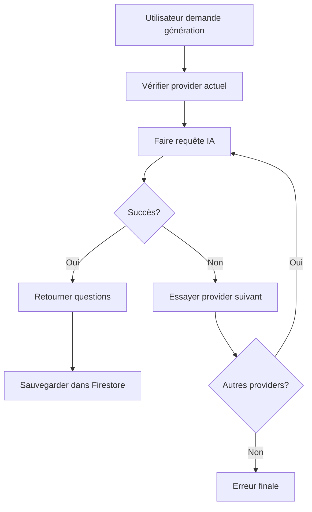

# ✅ Système IA Multi-Provider Complété - VTraining

## 🎯 Résumé de l'implémentation

Le système VTraining dispose maintenant d'un **système IA flexible et robuste** permettant de switcher facilement entre **4 providers d'IA** pour la génération automatique de questions de quiz.

## 🔧 Composants Implémentés

### 1. Configuration Multi-Provider (`src/config/ai.ts`)
- ✅ Support de 4 providers : **Deepseek**, **OpenAI**, **Anthropic**, **Gemini**
- ✅ Configuration unifiée avec transformateurs de requête/réponse
- ✅ Système de fallback automatique
- ✅ Gestion des authentifications spécifiques à chaque provider

### 2. Service IA Unifié (`src/services/aiService.ts`)
- ✅ API unifiée pour tous les providers
- ✅ Basculement automatique en cas d'échec
- ✅ Validation et nettoyage des réponses
- ✅ Gestion avancée des erreurs
- ✅ Singleton pattern pour la cohérence

### 3. Interface Utilisateur
- ✅ **AIProviderSelector** : Composant de sélection de provider
- ✅ **QuizSettingsEditor** : Intégration du sélecteur dans les paramètres de quiz
- ✅ **AIProviderTest** : Composant de test pour le développement
- ✅ Indication du provider actuel dans l'interface

### 4. Intégration Quiz (`src/services/quizService.ts`)
- ✅ Mise à jour pour utiliser le nouveau service IA
- ✅ Support des deux modes : **Pool** et **On-the-Fly**
- ✅ Génération de banques de questions optimisées
- ✅ Gestion des erreurs et fallbacks

### 5. Configuration et Documentation
- ✅ **`.env.example`** : Documentation complète des variables
- ✅ **Documentation système** : Guide complet d'utilisation
- ✅ **Scripts d'installation** : Configuration automatisée
- ✅ **Scripts de test** : Validation du fonctionnement

## 🚀 Utilisation

### Configuration Rapide
```bash
# Configuration interactive
npm run setup:ai

# Configuration directe  
.\scripts\setup-ai-providers.ps1 -Provider deepseek -ApiKey sk-xxxxx

# Test des providers
npm run test:ai
```

### Variables d'Environnement
```bash
# Provider par défaut
VITE_AI_PROVIDER=deepseek

# Clés API (configurez au moins une)
VITE_DEEPSEEK_API_KEY=sk-xxxxx
VITE_OPENAI_API_KEY=sk-xxxxx  
VITE_ANTHROPIC_API_KEY=sk-xxxxx
VITE_GEMINI_API_KEY=xxxxx
```

### Interface Utilisateur
1. **Éditeur de chapitre** → Activer quiz → Mode Banque
2. **Sélectionner le provider IA** dans l'interface
3. **Cliquer sur "Générer des questions avec l'IA"**
4. Les questions sont automatiquement sauvegardées

## 💡 Avantages du Système

### ✅ **Fiabilité**
- Basculement automatique si un provider échoue
- Pas de point de défaillance unique
- Gestion robuste des erreurs

### ✅ **Flexibilité**
- Changement de provider en temps réel
- Support facile de nouveaux providers
- Configuration par variables d'environnement

### ✅ **Optimisation des Coûts**
- Choix du provider le plus économique
- Deepseek recommandé (~$0.14/million tokens)
- Fallback vers providers gratuits (Gemini)

### ✅ **Expérience Utilisateur**
- Interface intuitive de sélection
- Feedback en temps réel du provider utilisé
- Messages d'erreur clairs et actionables

## 🔄 Flux de Fonctionnement



## 🧪 Tests et Validation

### Tests Automatisés
- ✅ Script de test de tous les providers configurés
- ✅ Mesure des performances (temps de réponse)
- ✅ Validation du format des questions générées

### Tests Interface
- ✅ Composant de test intégré (`AIProviderTest`)
- ✅ Test en temps réel dans l'interface
- ✅ Affichage des résultats et métriques

## 📊 Métriques et Monitoring

### Logs Disponibles
- Provider utilisé pour chaque requête
- Temps de réponse par provider
- Erreurs et fallbacks automatiques
- Nombre de questions générées

### Debug Mode
```bash
# Activer les logs détaillés
VITE_AI_DEBUG=true
```

## 🔒 Sécurité

- ✅ Clés API stockées uniquement côté client
- ✅ Aucune clé API dans le code source
- ✅ Variables d'environnement sécurisées
- ✅ Validation des réponses IA avant utilisation

## 📈 Roadmap

### Prochaines Améliorations
- [ ] Cache intelligent des réponses
- [ ] Analytics d'utilisation par provider
- [ ] Optimisation automatique des prompts
- [ ] Support de Cohere et Mistral
- [ ] Interface d'administration avancée

### Optimisations Futures
- [ ] A/B testing automatique des providers
- [ ] Quotas et budgets par provider
- [ ] Métriques de qualité des questions
- [ ] Support multi-langues avancé

## 📖 Documentation

- 📄 **Guide complet** : `docs/ai-multi-provider-system.md`
- 🔧 **Configuration** : `.env.example`
- 🧪 **Tests** : `scripts/test-ai-providers.mjs`
- ⚙️ **Setup** : `scripts/setup-ai-providers.ps1`

## 🎉 Résultat Final

Le système VTraining dispose maintenant d'un **système IA multi-provider robuste et flexible** qui :

1. ✅ **Fonctionne** avec 4 providers majeurs
2. ✅ **Bascule automatiquement** en cas de problème
3. ✅ **S'intègre parfaitement** dans l'interface existante
4. ✅ **Optimise les coûts** en permettant le choix du provider
5. ✅ **Reste simple à utiliser** pour les utilisateurs finaux

**Le système est prêt pour la production et peut être étendu facilement avec de nouveaux providers.**
